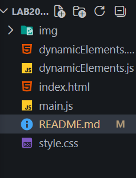

# Лабораторная работа №20: Работа с DOM и событиями в JavaScript

## Основная информация

**ФИО:** Селиванов Павел Беляев Владимир

**Группа:** ИСП-233

**Дата:** 20.03.2026

## Краткое описание работы

В ходе выполнения лабораторной работы были изучены:

- Структура DOM-дерева и работа с объектом `document`
- Поиск HTML-элементов с помощью `getElementById()` и `querySelector()`
- Изменение содержимого и стилей элементов
- Обработка событий пользователя (клик, отправка формы)
- Получение данных из полей ввода
- Валидация данных формы
- Динамическое создание и удаление элементов
- Делегирование событий

## Структура проекта

## Сравнение с C# (WinForms/WPF)

| Концепция            | C# (WinForms)                                 | JavaScript (DOM)                                       |
| -------------------- | --------------------------------------------- | ------------------------------------------------------ |
| Найти элемент        | `Button myButton = this.Controls["myButton"]` | `const myButton = document.getElementById("myButton")` |
| Изменить текст       | `label1.Text = "Новый текст"`                 | `label1.textContent = "Новый текст"`                   |
| Добавить обработчик  | `button1.Click += HandleClick`                | `button.addEventListener("click", handleClick)`        |
| Создать элемент      | `Button btn = new Button()`                   | `const btn = document.createElement("button")`         |
| Добавить в контейнер | `panel1.Controls.Add(btn)`                    | `panel.appendChild(btn)`                               |
| Скрыть элемент       | `button1.Visible = false`                     | `button.style.display = "none"`                        |

### Главные отличия

| Аспект      | C# WinForms         | JavaScript DOM      |
| ----------- | ------------------- | ------------------- |
| Компиляция  | Да                  | Нет (интерпретация) |
| Типизация   | Строгая             | Динамическая        |
| Ошибки      | Во время компиляции | Во время выполнения |
| UI-дизайнер | Есть (визуальный)   | Нет (только код)    |
| Платформа   | Windows             | Любой браузер       |

### Преимущества DOM перед WinForms

- Кроссплатформенность (работает везде)
- Не нужна установка приложения
- Легко обновлять (обновил файлы — всё работает)
- Современные UI (CSS, анимации)

### Преимущества WinForms перед DOM

- Визуальный дизайнер (drag & drop)
- Ошибки на этапе компиляции
- Интеграция с Windows API
- Более понятная структура

## Вывод

DOM и WinForms решают схожие задачи, но разными подходами.
